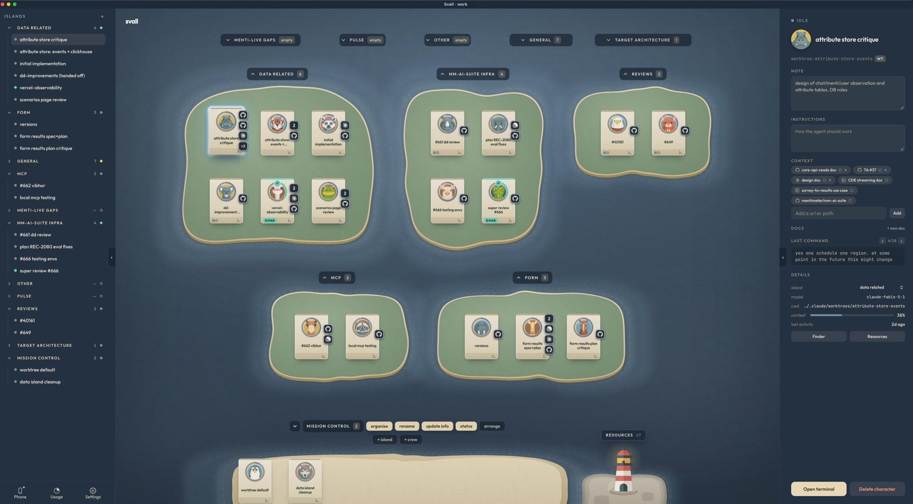

# Svall

> [!NOTE]
> **Alpha 0.1**: early and changing fast. Expect rough edges.

A macOS map of your Claude Code and Codex agents. Every terminal is a character
on an island, so you can see at a glance which agents are working, waiting on
you or done.

- Islands group your characters, say one per project, on a map or a board.
  Each card shows its agent's status, how full its context window is, its
  model and links such as its PR and ticket.
- Each terminal is a tmux window, so quitting the app or restarting the daemon
  loses nothing. After a reboot, reviving a character resumes its session with
  `claude --resume` or `codex resume`.
- Context carries over. Give an island or character instructions, and links,
  files or folders to read. Agents leave notes for the next agent, per fleet,
  repository, island or character. Each session starts with a short brief of
  all of it plus its repository, open PR and ticket, and gets a diff when any
  of it changes. The brief also tells the agent when to hand work to a new
  character, and to ask you before starting more than two or a new island.
- Resources gathers the instructions, skills, MCP servers, plugins and hooks
  that Claude Code and Codex give your agents, globally and per repository,
  and opens each in an editor.
- Every terminal has a browser, a file editor and the working tree's changes
  beside it.
- The scribe names each character and keeps its note current with what its
  agent is doing.
- Mission control has buttons that start a helper agent to update or report on
  the fleet.
- A macOS banner tells you when an agent is blocked or done, with Approve and
  Deny on it.
- Your phone gets the fleet and any terminal over Tailscale, with push
  notifications.
- The `svall` CLI scripts the fleet: make characters, send prompts, wait for
  them.

A daemon (`svalld`) runs each fleet; the app, the CLI and the phone are its
clients.

## Quickstart

Svall needs an Apple Silicon Mac on macOS 15 or newer, and Claude Code, Codex,
or both.

1. Install [Claude Code](https://code.claude.com/docs/en/setup); it works with
   a Claude subscription or an Anthropic API key, see
   [Using API keys](#using-api-keys). And/or install the
   [Codex CLI](https://learn.chatgpt.com/docs/codex/cli) 0.155 or newer; an
   OpenAI API key is enough, you don't need a ChatGPT subscription.

2. Get Svall, in one of two ways:

   - Download it from [svall.dev](https://svall.dev), drag `Svall.app` to
     Applications and open it.
   - Or run:

         curl -fsSL https://svall.dev/install.sh | sh

     It installs to `/Applications`, or `~/Applications` when that isn't
     writable, or `$SVALL_INSTALL_DIR`. It checks the download's checksum,
     refuses while Svall is running, and opens the app.

3. The first launch shows the setup screen: each agent it found with a toggle,
   your projects folder, where new characters start (made if missing), the
   files setup writes, and one "Set up" button. An agent you turn off gets
   no hooks; one you install later does. If `~/.local/bin` isn't on your PATH,
   the screen shows the line to add to your shell profile, so the `svall`
   command works in a terminal; no shell file is edited for you. Setup
   refuses to run from the disk image, so move Svall to Applications first.

4. `+ New island` on the sandbar at the bottom makes an island, and Cmd+T makes
   a character on it: a shell that becomes an agent when you type `claude` or
   `codex`. With both CLIs installed, the app's first question is which one the
   scribe and mission control run — Claude Code unless you pick Codex; change
   it later in Settings or with `svall agent codex`. On first launch, the app
   asks before the scribe makes paid agent calls. The first mission control
   button you press opens a terminal where Claude Code or Codex asks you to
   trust `~/.svall/home`.

Setup's hooks do nothing outside Svall. [What setup changes](#what-setup-changes)
lists every file setup writes.

### Using API keys

Svall runs the Claude Code and Codex CLIs and has no AI account or
billing of its own. The provider whose key you use bills the API calls.

For Claude Code, create an [Anthropic API key](https://console.anthropic.com/settings/keys)
and put it in the private fleet's `.env` (another fleet's is
`~/.svall-<fleet>/.env`):

    mkdir -p ~/.svall
    touch ~/.svall/.env
    chmod 600 ~/.svall/.env
    nano ~/.svall/.env

Add `ANTHROPIC_API_KEY=your-key` on its own line. Don't put the key in this
repository or in a shell command that history keeps. New character shells and the headless Claude scribe read it: create a
character and type `claude`, or run
`svall char new --island <island> --cwd <path> --claude`. A shell that is
already running keeps its old environment, so after changing the file, create
a new character or revive a dormant one. This also signs Claude Code itself in;
`svall doctor` reports it. Claude Code may ask once before it uses an API key
in an interactive session; see its
[environment variable reference](https://code.claude.com/docs/en/env-vars).

For Codex, sign the Codex CLI in with an
[OpenAI API key](https://platform.openai.com/api-keys) before you start a Codex
character. With `OPENAI_API_KEY` set in your normal terminal, run:

    printenv OPENAI_API_KEY | codex login --with-api-key
    codex login status

Codex keeps the login for later `codex` and `codex exec` runs. Then type
`codex` in a character, or run
`svall char new --island <island> --cwd <path> --agent codex`. See the
[Codex authentication guide](https://learn.chatgpt.com/docs/auth). An
`OPENAI_API_KEY` in the fleet's `.env` also reaches new character shells, but
only `codex login --with-api-key` signs Codex itself in; Codex doesn't read
the variable to log in on its own.

The scribe and mission control's crew both run the main agent's CLI, unless
`scribe.agent` names another (see [Configuration](#configuration)), so a
Codex-only install needs no Claude login or Anthropic key. The scribe still
costs money on whichever plan it runs on; leave it off in Settings to avoid
that. The Usage panel shows Claude's subscription limits, not API spending.

### Updating

Svall checks for updates on its own and installs one when you click it. Svall →
Check for Updates… checks now.

### Uninstalling

Svall → Uninstall Svall… stops every fleet, removes the hooks, the background
service and the `svall` command, and moves the app to the Trash. "Also delete
fleet data" removes `~/.svall` and the other fleets' homes too.
[Uninstall](#uninstall) has the details.

### When something breaks

Run `svall doctor`. It checks what the fleet needs and prints the end of the
daemon's log, `~/.svall/svalld.log`. Send its output, and what you were
doing, as an issue on
[linusroxbergh/svall](https://github.com/linusroxbergh/svall/issues).

### Migrating from Herdr

Ask your agent to move your Herdr workspaces into Svall. It reads them
with `herdr workspace list` and `herdr agent list`, then makes each workspace
an island (`svall island create`) and each agent pane a character in the same
directory, running the same agent
(`svall char new --island <island> --cwd <dir> --agent <claude|codex>`).
Only Claude and Codex panes are supported; other agents are untested.
`herdr --skill` and `svall <command> --help` cover the rest.

## Build from source (Svall Dev)

A checkout builds `Svall Dev.app`, which runs beside the release without
touching its fleets. It uses `~/.svall-dev` (and `~/.svall-dev-<name>`), the
`svall-dev` command and port 47900, and needs macOS 15.6 or newer with the
Command Line Tools for Xcode 26 or newer, which Homebrew installs. On an Apple
Silicon Mac the install downloads the terminal engine prebuilt, and the clone,
its dependencies and the build take about 750 MB of disk. An Intel Mac also
needs Xcode; see [Building Ghostty from source](#building-ghostty-from-source).

1. Install the tools, and Claude Code, Codex, or both:

       brew install node tmux pnpm gh   # skip node if you have 24 or newer
       gh auth login                    # clones the private repository, downloads the terminal engine and resolves PR links

   If `xcrun --show-sdk-version` prints a version below 26, update the Command
   Line Tools in System Settings → General → Software Update, or Xcode if
   `xcode-select -p` points into it. If your pnpm came
   from somewhere other than Homebrew, `pnpm --version` must show 12 or newer.
   Update it the way you installed it, such as `npm i -g pnpm@latest` or
   `pnpm self-update`.

2. Clone and install:

       git clone https://github.com/linusroxbergh/svall && cd svall
       pnpm desktop:install

   The installer lists anything missing before it builds, asks nothing, and
   ends with the main agent it will run: your only installed CLI, or Claude
   Code with both installed. Without admin rights, run
   `SVALL_APP_DEST=~/Applications pnpm desktop:install` instead. If your shell
   can't find `svall-dev` afterwards, add `~/.local/bin` to your PATH:

       echo 'export PATH="$HOME/.local/bin:$PATH"' >> ~/.zshrc   # then open a new terminal

3. Run `svall-dev`, or open Svall Dev from Spotlight, and use it as in the
   Quickstart. While no release is installed, Svall Dev also installs `svall`.
   With a release installed, a `svall` run inside a Svall Dev fleet hands off
   to `svall-dev`. Fleet names `dev` and `dev-*` are refused.

Keep the clone where it is, because `svall-dev` and the daemon run from it. If
you move it or clone it again, `pnpm desktop:install` in the new place points
them there. `svall-dev uninstall` removes Svall Dev; run it before you delete
the clone, or launchd restarts the missing daemon every ten seconds.

### Updating Svall Dev

    git pull && pnpm desktop:install

If pnpm says it failed to switch versions, update pnpm to 12 or newer the way
you installed it (`brew upgrade pnpm`, `npm i -g pnpm@latest`, or
`pnpm self-update` run outside the clone) and try again. If it says the Node
version is unsupported, run `brew upgrade node`.

### Building Ghostty from source

The installer downloads GhosttyKit, the terminal engine, prebuilt for the
Ghostty version this checkout pins. It builds GhosttyKit from source instead
when the download fails: on an Intel Mac, when `gh` isn't signed in (run
`gh auth login` and install again), or when no build of that version has been
published. That needs Xcode 26 or newer from the App Store (the Command Line
Tools alone are not enough). Open Xcode once to accept its license, then run:

    sudo xcode-select -s /Applications/Xcode.app
    xcodebuild -downloadComponent MetalToolchain
    brew install zig@0.15

The first build takes several minutes and about 1.2 GB of disk.

## Concepts

- **Fleet**: one daemon, one tmux server, one window. `svall` opens the
  private fleet; `svall work` creates a separate one (any lower-case name
  works; `svall -p <name>` makes one whose name reads like a mistyped
  command). Opened from Finder or Spotlight with two or more fleets, the app
  asks which; File → Open Fleet… (Cmd+Shift+O) opens or makes another from
  the app. Settings → name renames a fleet, and `svall <name>` opens it by
  that name too.
- **Island**: a group of characters. Mission control is the fixed one at the
  bottom.
- **Character**: one terminal. Type `claude` or `codex` in it and the map
  tracks the agent: `working`, `idle`, `blocked` (waiting on you), or `done`.
  An agent left idle for 12 hours is closed on its own, to free the memory it
  holds, and opening its terminal resumes it; Settings → close idle agents
  after changes the wait or turns it off.
- **Scribe**: a minute after an agent stops with new work, a headless
  `claude -p` or `codex exec`, on the main agent, writes the character's name,
  note and links, and the island's description. A name you gave only gains a
  PR or ticket in front, and a note you wrote stays. An agent that keeps
  working gets a pass about every ten minutes too. Passes start at most once a
  minute, so a busy fleet can run up to 60 an hour. Each pass uses the chosen
  CLI's login, which costs money on an API key. A new fleet asks before
  turning it on, and you can turn it off in settings.

## The desktop app

- **Map**: double-click a card to open its terminal; Cmd+Enter switches
  between half and full size. Drag cards between islands, or onto water to make
  a new island. Drag an island's label to move it and its corner to resize it.
  On mission control, `arrange` packs the fleet into the window,
  `+ New island` and `+ New character` add an island or a crew member, and the
  other buttons start a helper agent with a prompt, which spends the main
  agent's usage. `update info` also runs the scribe over every character;
  while the scribe is off, its agent says so and stops.
- **Board** (Cmd+M): islands as a folder tree, with the selected character's
  terminal beside it and its island's characters as tabs. Drag a character
  onto an island to move it, or onto another character to swap them. Drag an
  island to reorder the list; mission control stays last.
- **Side card** (Cmd+I): the character's note, agent profile and
  instructions, context, docs, last prompts, model, directory and context
  use. Links open in the character's browser or your default one.
- **Browser** (Cmd+2; Cmd+B puts it beside the terminal on the board): tabs
  survive a relaunch, and the agent can read them. You sign in once per fleet:
  import Chrome's cookies once (macOS asks first), or fill logins from
  1Password (Cmd+Shift+P; needs the 1Password CLI with its app integration).
- **Files** (Cmd+3): an editor for the character's directory, with Cmd+S to
  save and Cmd+F to find and replace. If the agent rewrites a file you haven't
  changed, it reloads. Create, rename and delete files in the terminal.
- **Changes** (Cmd+4): each file's diff against HEAD, or against the point
  where the branch left main.
- **Resources** (Cmd+Shift+R, or the lighthouse islet): what `~/.claude`,
  `~/.codex`, this fleet's docs and each repository give your agents, each
  opening in an editor.
  `~/.claude.json` and `~/.codex/auth.json` hold tokens and are never opened.
- **Settings** (Cmd+,): zoom, terminal opacity, scribe, notifications, phone,
  browser and keyboard. `Usage`, next to it, shows your Claude plan's session
  and weekly limits without using any.

### Keyboard

Terminals are Ghostty surfaces and read `~/.config/ghostty/config`. The app
takes the chords below and passes everything else to the terminal. Rebind or
clear any of them under *The keyboard* in settings. A chord your Ghostty config
binds stays with Ghostty until you claim it there.

| Keys | Action | Keys | Action |
| --- | --- | --- | --- |
| Cmd+T | New character | Cmd+W | Close it (asks first) |
| Cmd+J | Next character | Cmd+K | Previous character |
| Cmd+Shift+J | Next island | Cmd+M | Map or board |
| Cmd+I | Side card | Cmd+Enter | Card size |
| Cmd+1 to 4 | Terminal, browser, files, changes | Cmd+B | Browser beside the terminal |
| Cmd+L | Address bar | Cmd+G | Mission control |
| Cmd+Shift+R | Resources | Cmd+Shift+P | Fill a login from 1Password |
| Cmd+, | Settings | Cmd+- / = / 0 | Zoom |
| Cmd+Shift+A | Arrange the fleet | Cmd+U | First link beside the terminal |

Ctrl+click opens a link in the character's browser. Selecting text copies it.
A browser tab you're typing in keeps Cmd+B, Cmd+I, Cmd+U, Cmd+K and Cmd+Enter
for the site. Each terminal attaches to its character's tmux session, so your
Ghostty `initial-command` and `input` are ignored.

## The `svall` CLI

    svall status                                  # every island and character
    svall island create feature
    svall char new --island feature --cwd ~/repo --claude
    svall char run <id> "review the failing tests in src/api"
    svall char wait <id> --until done,blocked     # exits 0 on a match, 2 on timeout, 3 when gone
    svall char read <id> --transcript --lines 20
    svall char revive <id>                        # a dormant character, resumed
    svall char show <id>                          # everything, and the brief its agent gets

- A name works wherever an id does. `--json` prints machine-readable output,
  `-p <fleet>` targets another fleet, and `--term 2` a split character's second
  terminal.
- `--instructions` on an island or character is for the agent only, such as
  "merge without asking".
- `--agent-profile <name>` on a character gives its agent a role: one of the
  `.md` files in the fleet's `agent-profiles` folder. Six ship with a new fleet
  (architect, debugger, explorer, planner, reviewer, verifier); Resources lists
  them under the fleet, where you edit them or write your own.
- `--context "<url or path>[ label]"` attaches links, files or folders, and
  `--pin` marks one to read first.
- `svall <command> --help` lists the rest.

## Phone

    svall mobile          # serve over Tailscale and print a QR (also a switch in settings)
    svall mobile off

- Open the link (`https://<mac>.<tailnet>.ts.net`) on your phone, then choose
  Share → Add to Home Screen. You get every island and character as a list,
  and a character's terminal full screen with Esc, Tab, Ctrl-C and arrow keys
  above the keyboard.
- `⚙` → *Notify this phone* sends a push when an agent is blocked or done. Tap
  a blocked one to approve or deny it.
- The tailnet needs MagicDNS and HTTPS certificates, both turned on in
  Tailscale's admin console. The certificate puts the Mac's tailnet name in a
  public log.
- Tailscale gives the page a trusted certificate and vouches for who connects,
  so no token reaches the phone. Only your own tailnet login gets in. To let
  others in, list their logins and yours in `mobile.logins` and restart the
  daemon.
- Each fleet is its own Home Screen app: the private fleet on port 443 and the
  next on 8443. A third fleet needs `mobile.httpsPort: 10000`, which Svall
  Dev's private fleet also takes. Tailscale serves one fleet per port on the
  Mac, so a fleet whose port another already serves says so and leaves it.

## Configuration

A fleet keeps everything in its home: `~/.svall` for the private fleet
and `~/.svall-<name>` for the others, unless `SVALL_HOME` says otherwise.
Its `config.json` takes:

| Key | What it does |
| --- | --- |
| `name` | What the window title and `svall <name>` call the fleet: lowercase letters, digits and dashes, starting with a letter, and not an `svall` command. Absent, the directory names it. Set from Settings. |
| `port`, `host` | Where the daemon listens, `47800` on `127.0.0.1` by default. Any address off loopback sends the API token in plain text. |
| `defaultCwd` | Where a new character starts when no character beside it gives it a directory (default `~`). Set by the setup screen's projects folder or `svall setup --projects`. |
| `shell` | The shell a terminal runs, if not your login shell. |
| `linear` | `{ "workspace": "acme", "teamKeys": ["ENG"] }` links a branch named after a Linear issue to that issue. |
| `mainAgent` | `claude` or `codex`: what the scribe, mission control's crew and `svall char new --run` run by default. Absent, the private fleet's, else the only CLI installed, else `claude`. Set from the app or with `svall agent <name>`. |
| `integrations` | The private fleet's list of agents, `claude` and `codex`, whose hooks setup installs. Absent, every agent found. Set by the setup screen or `svall setup --agents`. |
| `home` | Mission control: `cwd` for its crew, the `command` that starts an agent (default the main agent's: `claude --model sonnet`, or `codex`), and `actions`, one `{ "label", "prompt" }` per button. A button's `/name` prompt reaches a Codex crew as `$name`. |
| `scribe` | `agent` (default the main agent) and `model`, a model of `agent`'s CLI, or of Claude's when `agent` is unset (default `sonnet`). |
| `mobile` | `logins` to let in (only yours when empty), extra page `origins` allowed to open a socket, a `pushContact` (https: or mailto:) for push services, and `httpsPort`. |

- The daemon reads `config.json` when it starts.
  `launchctl kickstart -k gui/$(id -u)/io.github.linusroxbergh.svall.svalld`
  restarts the private fleet's daemon; use
  `io.github.linusroxbergh.svall.svalld.<name>` for another fleet. While
  the file doesn't parse, the daemon logs why and waits for it to change;
  `svall doctor` shows the error too.
- Mission control's folder (default `~/.svall/home`, shared by every
  fleet) holds files for both CLIs, rewritten on every daemon start. For
  Claude Code: `CLAUDE.md`, yours to edit, and `.claude/`, with its
  instructions in `.claude/rules/svall.md`, the `svall-*` skills its
  buttons call, and `.claude/settings.json`. For Codex: `AGENTS.md`, built
  from the rules and your `CLAUDE.md`, `.agents/skills`, and
  `.codex/rules/svall.rules`, which lets a Codex crew run the same
  `svall` commands a Claude crew may, without asking. `svall-organise` and
  `svall-rename` have no button: list them in `home.actions` beside the two
  defaults (`/svall-update-info` and `/svall-status`) to get one. Only
  `svall setup` replaces an edited settings file, and it keeps a `.bak-*`
  copy. Codex and Claude Code each ask once whether to trust the folder.
- The daemon runs under launchd, without your shell's environment. The
  fleet's `.env` gives the Claude scribe every value in it, and gives **new**
  character shells only `ANTHROPIC_API_KEY` and `OPENAI_API_KEY`. Keep the
  file private (`chmod 600`); see [Using API keys](#using-api-keys).

### Codex

A character running `codex`, typed in or started with
`svall char new --agent codex`, gets the same status, context gauge, revive,
brief and scribe as Claude Code.

- Setup writes Svall's hook into `~/.codex/hooks.json` when Codex is on in
  the setup screen, or, for `svall setup` in a terminal, when Codex is found
  and not turned off there or with `--agents`, but Codex runs only hooks you trust: choose
  "Trust all and continue" on its startup dialog, or trust it later with
  `/hooks`, and do so again whenever the hook changes. `svall doctor` says
  whether it's trusted. Until then the character stays a plain shell with a
  warning.
- Codex needs its CLI on PATH; the Codex desktop app alone doesn't put it
  there.

## What setup changes

The app's setup screen runs `svall setup`, which you can also run on its own
without the app (`--check` only checks). It changes nothing while something it
needs is missing. For each agent you leave on, it writes:

- `~/.claude/settings.json` (or `$CLAUDE_CONFIG_DIR/settings.json`), for Claude
  Code: a hook on Claude Code's session, prompt, tool, permission,
  notification, stop and subagent-stop events, which exits before starting Node
  outside a character, and a statusline wrapper that keeps your own statusline
  running inside it. Every change keeps a `.bak-<time>` copy.
- `~/.codex/hooks.json`, for Codex (creating `~/.codex`): the same hook and
  backup.

It also writes:

- `~/Library/LaunchAgents/io.github.linusroxbergh.svall.svalld*.plist`,
  one per fleet, which keeps each daemon running.
- `~/.local/bin/svall`: a shim into `Svall.app`.
- `~/.svall` and `~/.svall-<name>`: each fleet's state, config,
  log, hook scripts, tmux.conf and tmux server, plus, in `~/.svall/home`,
  the mission control folder they share.

Svall Dev writes the same under `.svall-dev`, `svall-dev` and
`io.github.linusroxbergh.svall.dev.svalld*`, and a hook of one variant ignores
the other's fleets.

### Uninstall

Svall → Uninstall Svall… lists what goes and warns that running agents stop.
"Also delete fleet data" deletes the fleet homes and the app's preferences,
sign-ins and caches in `~/Library`. Without it they stay. Either way it quits
the fleets, removes the hooks (your own statusline stays), the launchd agents,
the `svall` command and each fleet's phone link, stops the fleets' tmux servers
so no agent keeps running out of sight, and moves the app to the Trash. The
settings backups stay.

In a terminal, `svall uninstall` does the same except it doesn't move the app
to the Trash: it asks before deleting the fleets and the app (in `/Applications`
or `~/Applications`), and `--purge` deletes them without asking.

## What leaves your Mac

Svall has no telemetry, analytics or crash reporting. The main ways data
leaves the Mac, beyond what your agents send:

- The scribe sends the end of each agent's transcript to Claude (or Codex) on
  your login or API key, with what the map shows of the character and its
  island: names, notes, links, directories and branches.
- Mission control's buttons start the main agent, and the Usage panel asks
  Claude Code for your plan's limits. The Claude scribe and the Usage panel run
  with every value in the fleet's `.env` in their environment.
- For each character in a repository, the daemon runs `gh pr view` to find its
  branch's PR on GitHub.
- `svall mobile` serves the fleet to your tailnet with `tailscale serve`.
- Svall checks `https://svall.dev/appcast.xml` for updates, which tells
  svall.dev your IP address and the version you run. Svall Dev doesn't.
- Push notifications go through your phone's push service: Apple's, Google's
  or Mozilla's. The character's name and prompt are encrypted for your phone;
  the service sees when a push is sent, and the page's address
  (`https://<mac>.<tailnet>.ts.net`) unless `mobile.pushContact` names another
  contact.

Importing Chrome's cookies sends nothing anywhere, but it copies the profile's
sign-ins into the fleet's browser on this Mac, so every site the profile is
signed in to is signed in there too.

## How it works

- Each fleet runs one private tmux server with a window per character. The
  daemon drives it over a single control-mode client and is the only writer of
  the fleet's `state.json`.
- Clients talk to the daemon over one loopback WebSocket: a full snapshot,
  then JSON-patch events. The app and the CLI present a token; the phone comes
  through `tailscale serve`, which vouches for its login.
- Agent status comes from hooks writing to the fleet's `hooks.sock`, and
  Claude Code's context use and model come from its statusline. Both do
  nothing without the `SVALL_CHAR_ID` a character sets, so `claude` run
  elsewhere is unaffected.
- On start, the daemon matches `state.json` against the live tmux windows.
  Characters whose window is gone turn dormant, ready to revive.

## Development

    pnpm test            # needs tmux on PATH for the integration tests
    pnpm typecheck
    pnpm e2e             # Playwright against a temporary daemon
    pnpm desktop:dev     # Vite dev server plus a debug app; SVALL_HOME picks the daemon, unless it names a release fleet
    pnpm desktop:build   # an unsigned apps/desktop/mac/build/Svall Dev.app
    pnpm app:build       # apps/desktop/mac/build/Svall.app, with its own node, tmux, daemon and CLI
    pnpm ghostty:build   # GhosttyKit from vendor/ghostty (v1.3.1) into vendor/ghostty-kit
    pnpm ghostty:publish # build GhosttyKit and upload it for installs to download
    mkdir -p /tmp/svall-dev && echo '{ "port": 0 }' > /tmp/svall-dev/config.json
    SVALL_HOME=/tmp/svall-dev pnpm svalld   # port 0 keeps it off the private fleets' 47800 and 47900

The first `pnpm e2e` needs
`pnpm --filter @svall/desktop-web exec playwright install chromium`.

`pnpm ghostty:publish` builds GhosttyKit for the Ghostty commit HEAD records
and uploads it to the `ghostty-kit` release, where `pnpm desktop:install`
downloads it. Publish after committing a `vendor/ghostty` bump, or installs of
that commit need Xcode; until the bump is committed, `pnpm desktop:install`
keeps the kit `pnpm ghostty:build` made from it. When a change to
`scripts/ghostty-build.sh` changes what it builds, also bump `REV` in
`scripts/ghostty-kit.sh` before publishing, so existing checkouts replace their
kit. It needs the Metal toolchain and zig.

- `packages/protocol`: state types and message schemas (zod).
- `packages/svalld`: the daemon (tmux, state, hooks, transcripts, API).
- `packages/cli`: the `svall` client.
- `apps/desktop`: a Swift/AppKit shell hosting a React app in a WKWebView with
  libghostty terminals; `web/src/mobile` is the phone view over the same store.
- TypeScript on Node 24, pnpm workspaces, vitest.

## License

The code is MIT (`LICENSE`). The animal portraits in
`apps/desktop/web/public/animals` and the lighthouse in
`apps/desktop/web/public/resources` are Flaticon icons by Magnific under a
Flaticon Premium licence, not MIT, and may not be redistributed: don't copy
them out of this repository (see the `LICENSE` in each folder). The fonts in
`apps/desktop/web/public/fonts` are SIL OFL 1.1 (`OFL.txt`), and Ghostty is
MIT under its own notice (`apps/desktop/mac/LICENSE.ghostty`). `Svall.app`
carries the licences of everything bundled in `Contents/Resources/Licenses`
(`scripts/licenses.mjs`).
